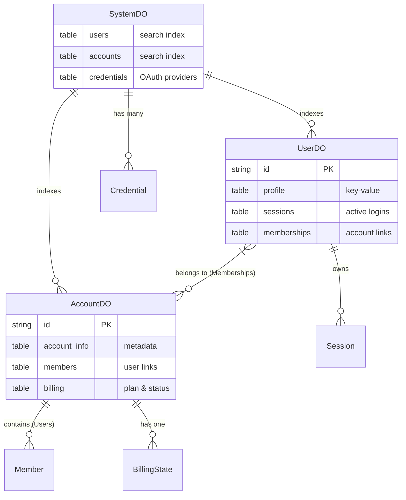

# System Architecture

## Overview

StartupAPI is built as a distributed system using Cloudflare Workers and Durable Objects. It follows a multi-tenant architecture where users and accounts are managed as independent, stateful entities.

## Data Relationships

The following diagram illustrates how different Durable Objects interact within the system:

## Core Components

### 1. Durable Objects

- **UserDO**: Represents a unique user. Stores profile information, OAuth credentials, active sessions, and account memberships.
- **AccountDO**: Represents a tenant (organization or team). Manages account-level metadata, member lists (User IDs and roles), and billing/subscription state.
- **SystemDO**: Acts as a global directory and search index. It maintains a list of all users and accounts to support administrative search and listing features.

### 2. Authentication Flow

Authentication is handled via OAuth2 (Google, Twitch). When a user logs in:
1. The `handleAuth` function intercepts the OAuth callback.
2. It identifies or creates the corresponding `UserDO`.
3. It creates a session and returns a signed, encrypted cookie to the browser.
4. Subsequent requests use this session cookie to identify the user and their current account.

### 3. Account & Membership Management

Users can be members of multiple accounts.
- `UserDO` maintains a `memberships` table indicating which accounts the user belongs to and which one is currently active.
- `AccountDO` maintains a `members` table listing all users who have access to that account.
- Changes are synchronized between both objects to ensure consistency.

## Frontend & Integration

- **Power Strip**: A custom element (`<power-strip>`) injected into proxied HTML pages. It provides a consistent UI for login, account switching, and profile management.
- **API Proxy**: The worker acts as a proxy, intercepting `/users/` paths for system features while forwarding other requests to the configured `ORIGIN_URL`.
